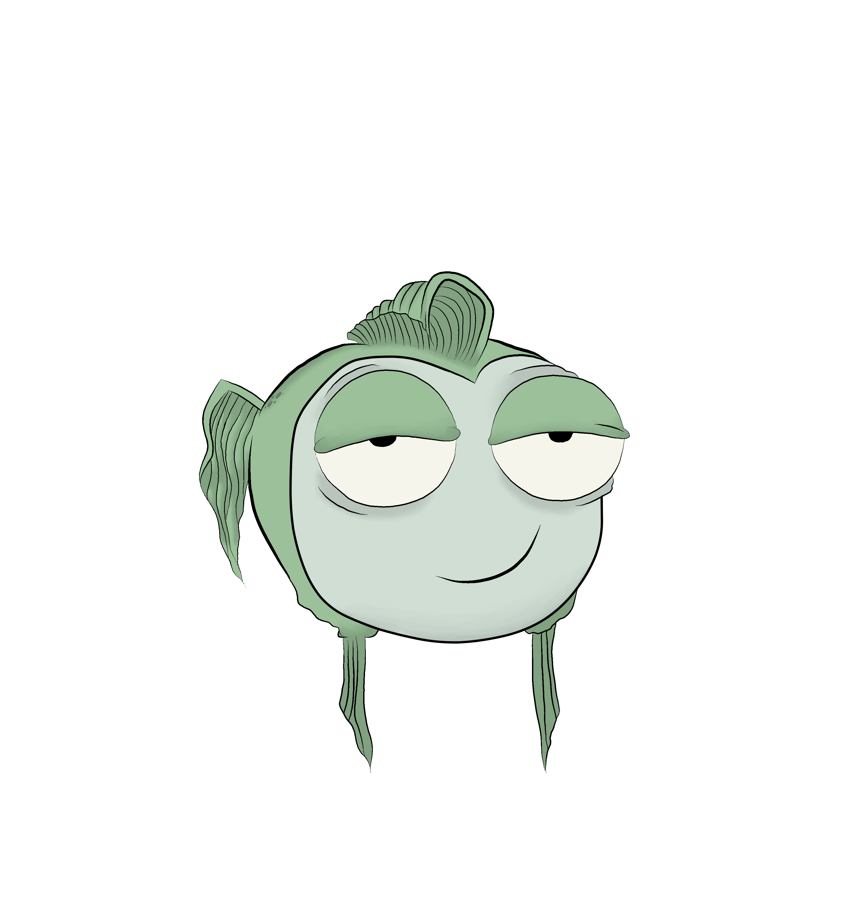
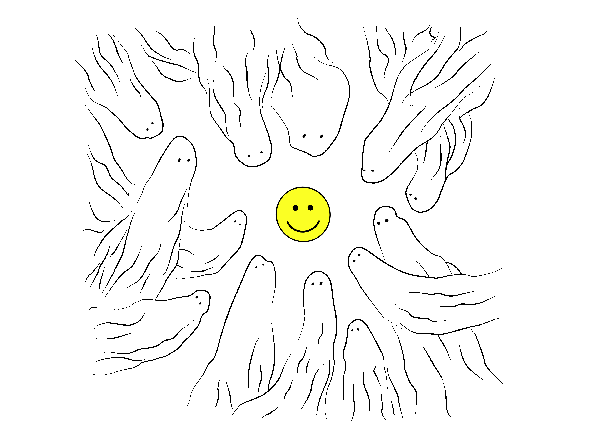
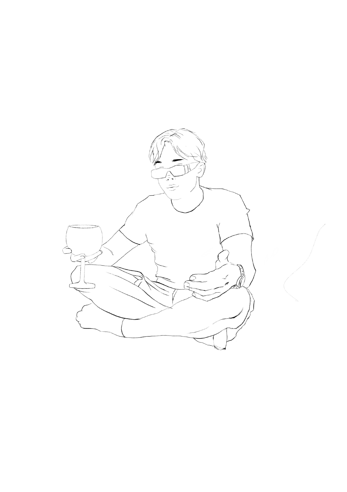
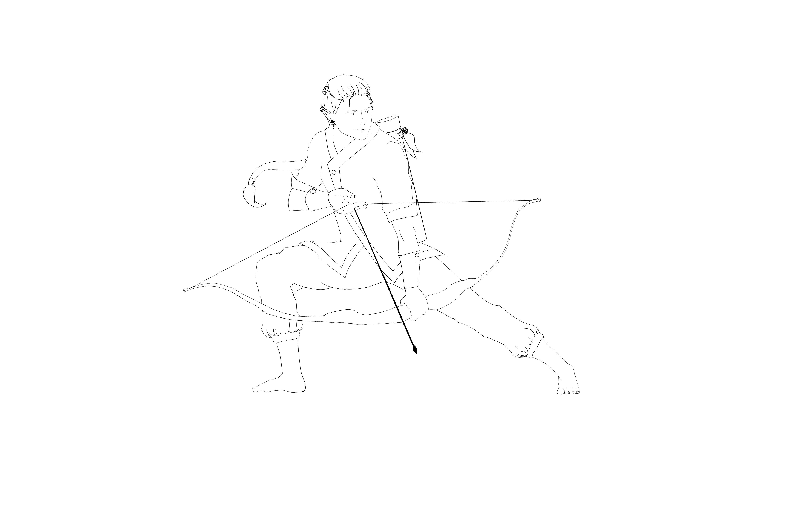
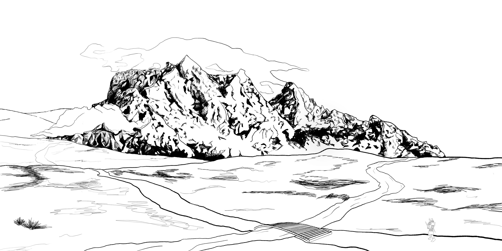
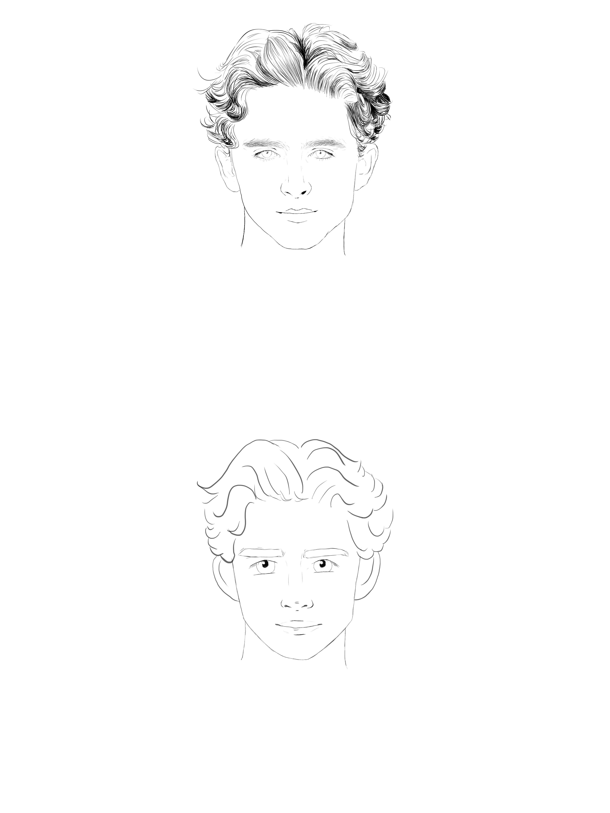
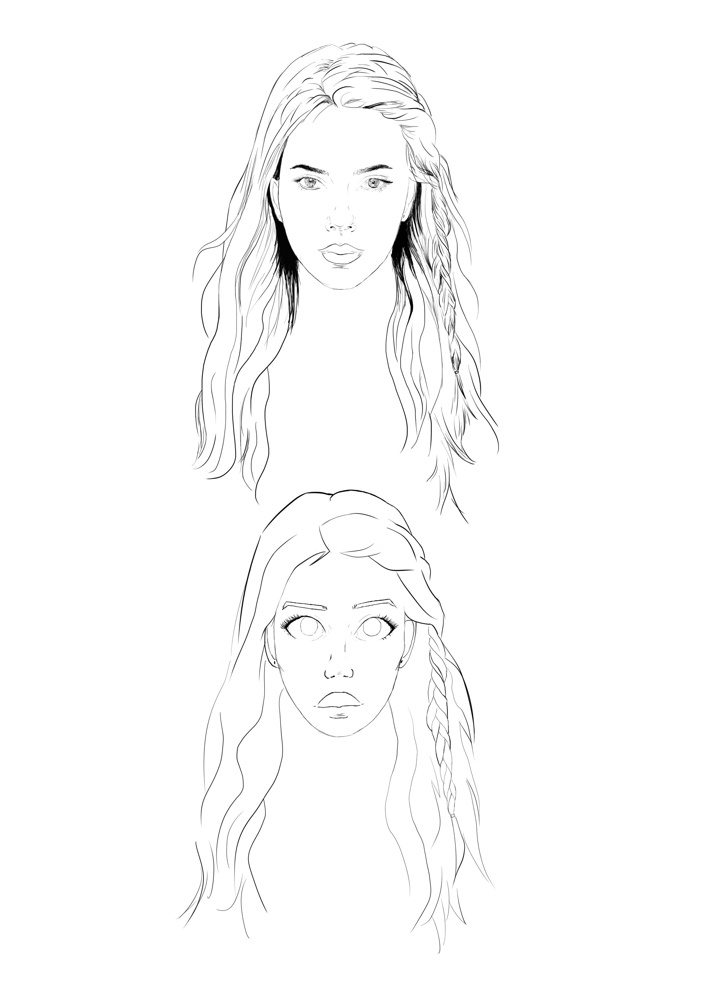
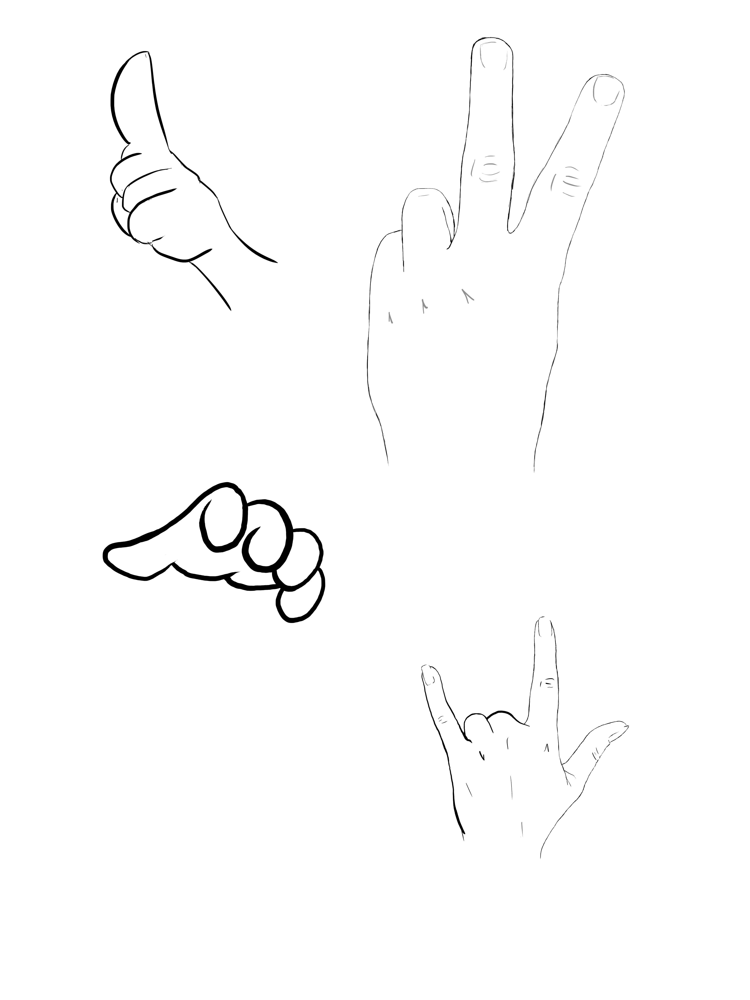
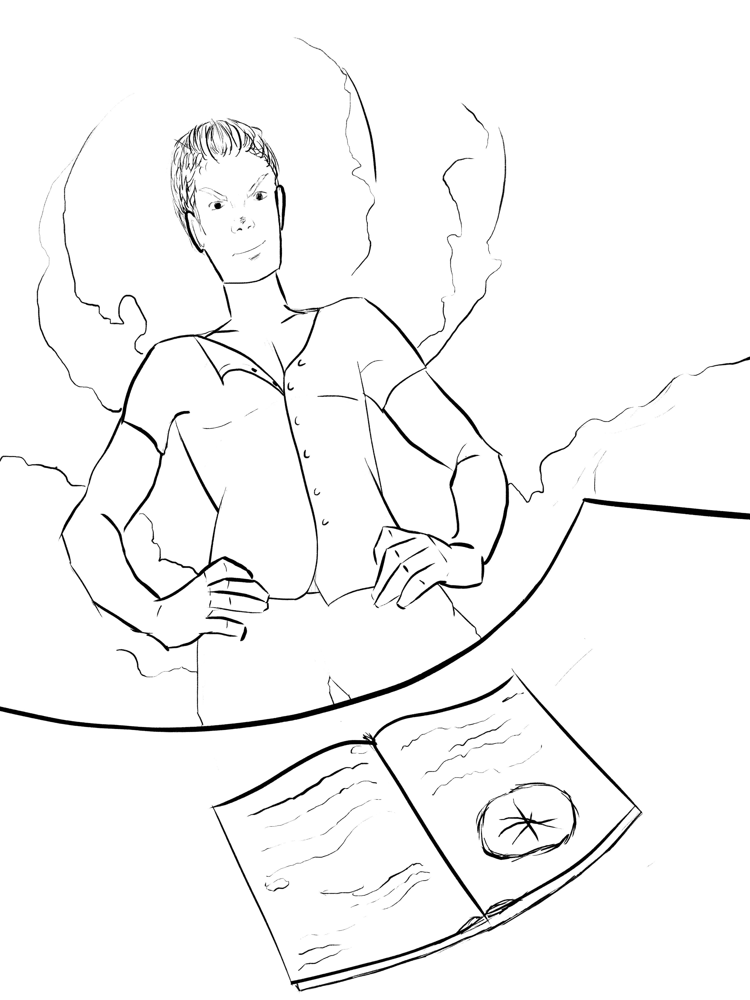

# Portfolio
<html>
<head>
    
    <link rel="stylesheet" type="text/css" href="FernandezBermejoJuliaP2.css">
</head>
<body>
    <h1 id="port">PORTFOLIO TRABAJOS</h1>
 
 

    
    
    
    
    
    
    
    
    
    

 
 

<h1>BIBLIOGRAFIA</h1>

  Nací en Donostia-San Sebastián, en 2003. Desde pequeña he disfrutado mucho al dibujar y eso me introdujo al mundo del arte. El cual,  mas adelante,  me introdujo al mundo de los videojuegos y el arte digital. En Septiembre del año pasado (2021), empecé a estudiar Diseño y Desarrollo de Videojuegos en la universidad Jaume I,  en Castellón. Además, he tenido experiencia creando diseños para marcas de ropa.

 Una imagen vale más que mil palabras. Estos son algunos de mis trabajos más destacables. Los tres primeros son diseños para una colección de ropa, y el resto trabajos realizados durante el primer semestre del grado.

 
 

CORREO DE CONTACTO:
    <a href="*">
veintenile@gmail.com

</body>

 
 

    <footer>Julia Fernandez</footer>
</html>
